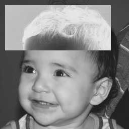
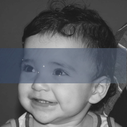

Exercícios **2 - 6** encontrados na [página do professor Agostinho Brito](https://agostinhobritojr.github.io/tutorial/pdi/)

## Região Negativa

O exercício encontrado na [seção 2.2](https://agostinhobritojr.github.io/tutorial/pdi/#_exerc%C3%ADcios) pede para que dado uma imagem e dois pontos, uma região seja traçada e exibida com o negativo da imagem.

Para isso, foi convencionado que a entrada do algoritmo seria escrito como mostrado logo abaixo:

```
$ python3 setup.py <path_da_imagem> <coord_x_p1> <coord_y_p1> <coord_x_p2> <coord_y_p2>
```

Antes do processamento é necessário garantir que todas as entradas sejam fornecidas bem como garantir que os pontos se encontrem dentro da imagem. O trecho de código abaixo mostram como esses tratamentos foram feitos.

```python
if len(sys.argv) < 6:
    sys.exit("Missing parameters")

if img is None:
    sys.exit("Could not read the image")

rows, columns = img.shape

if p1[0] > rows or p1[1] > columns:
    sys.exit(f"P1 should be inside the picture dimensions ({rows}X{columns})")
if p2[0] > rows or p2[1] > columns:
    sys.exit(f"P2 should be inside the picture dimensions ({rows}X{columns})")

if p1[0] > p2[0]:
    sys.exit(f"P1 x coordinate should be lower than P2 x coordinate")
if p1[1] > p2[1]:
    sys.exit(f"P1 y coordinate should be lower than P2 y coordinate")
```

Passando do estágio de verificação, o negativo da região passada é obtido percorrendo os _pixels_ da região trocando o seu valor pelo complemento conforme demonstrado no trecho de código abaixo.

```python
for i in range(p1[0], p2[0]):
    for j in range(p1[1], p2[1]):
        img[i][j] = 1-img[i][j]
```

Fazendo isso, o resultado será a imagem com a região escolhida em negativo

<center>
<figure float="middle" class="image">
  
  <figcaption>Figura 1 - Imagem de entrada</figcaption> 
</figure>
<figure class="image">
  
  <figcaption>Figura 2 - Imagem de Saída com os pontos P1(10,10) e P2(100,220)</figcaption>  
</figure>
</center>

## Troca de Regiões

Nesse exercício, foi pedido para que passando uma imagem, os quadrantes sejam trocados nas diagonais. Para isso, foi convencionado que a imagem seria passada pelo terminal na hora da execução utilizando-se do comando abaixo.

```
$ python3 setup.py <path_da_imagem>
```

Após a imagem ser processada com sucesso, foi obtido o _pixel_ de separação dos quadrantes. Considerando que as imagens passadas serão quadradas o _pixel_ de separação foi obtido utilizando-se do seguinte algoritmo.

```python
row_limit = int(rows/2)
columns_limit = int(columns/2)
```

Uma vez obtidos os _pixels_ de separação, as quatro regiões (quadrantes) da imagem foram obtidos da seguinte forma

```python
region1 = img[0:row_limit, 0:columns_limit]
region2 = img[0:row_limit, columns_limit:columns]
region3 = img[row_limit:rows, 0:columns_limit]
region4 = img[row_limit:rows, columns_limit:columns]
```

Por fim, os quadrantes foram concatenados na nova ordem formando a imagem de saída conforme mostrado no trecho de código e nas Figuras 3 e 4 abaixo

```python
upper_img = cv.hconcat([region4, region3])
lower_img = cv.hconcat([region2, region1])

out_img = cv.vconcat([upper_img, lower_img])
```

<center>
<figure float="middle" class="image">
  
  <figcaption>Figura 3 - Imagem de entrada</figcaption> 
</figure>
<figure class="image">
  
  <figcaption>Figura 4 - Imagem de Saída com os quadrantes trocados</figcaption>  
</figure>
</center>

## Labeling

O exercício de labeling, no tópico de [preenchimentos de regiões](https://agostinhobritojr.github.io/tutorial/pdi/#_exerc%C3%ADcios_2), pergunta em seu primeiro tópico, o que acontece caso se tenha mais de 255 objetos na cena e a solução.

Observando o algoritmo de [labeling](https://agostinhobritojr.github.io/tutorial/pdi/exemplos/labeling.cpp) é possível perceber que ao exceder uma quantidade de objetos de 255, o programa original irá ter uma falha ao tentar preencher um tom de cinza inexistente na imagem. Para solucionar esse problema passou-se a utilizar o resto da divisão do contador por 254 somado de um como o tom de cinza do objeto e passamos a incrementação do contador para depois da decisão do tom de cinza, assim teremos tons de cinza variando entre 1 e 254.

No segundo ponto do exercício é pedido para que se aprimore o algoritmo de modo a não contar bolhas que tocam as bordas da imagem e identificar bolhas com ou sem buracos internos, considerando ainda que podem existir regiões com mais de um buraco.

<center>
<figure float="middle" class="image">
  
  <figcaption>Figura 5 - Imagem utilizada como entrada</figcaption> 
</figure>
</center>

Na solução feita, inicialmente as bordas da imagem (Figura 5) foram limpas utilizando-se do método _foodFill_ , conforme pode ser visto abaixo, passando como parâmetro a cor do fundo da imagem, que nesse caso é preto (0).

```python
rows, columns = img.shape

for i in range(columns):
    cv2.floodFill(img,None,(i,rows-1),0)
    cv2.floodFill(img,None,(i,0),0)

for j in range(rows):
    cv2.floodFill(img,None,(columns-1,j),0)
    cv2.floodFill(img,None,(0,j),0)

```

<center>
<figure float="middle" class="image">
  
  <figcaption>Figura 6 - Imagem após o tratamento de bordas</figcaption> 
</figure>
</center>

Após o tratamento das bordas (Figura 7), a quantidade de objetos presentes na imagem foi contado utilizando-se do método de _labeling_ já mencionado anteriormente

<center>
<figure float="middle" class="image">
  
  <figcaption>Figura 7 - Imagem após Labeling</figcaption> 
</figure>
</center>

```python
noObjects = 0
for i in range(columns):
    for j in range(rows):
        if img[i,j] == 255:
            shade = 1 + (noObjects%254)
            cv2.floodFill(img,None,(j,i),shade)
            noObjects+=1

print(f'We found {noObjects} objects in the picture')

```

Em seguida, trocou-se a cor do plano de fundo para branco (255), deste modo, é possível identificar os buracos presentes na figura pela cor preta (Figura 8).

```python
cv2.floodFill(img,None,(0,0),255)
```

<center>
<figure float="middle" class="image">
  
  <figcaption>Figura 8 - Imagem após a troca de cor no plano de fundo</figcaption> 
</figure>
</center>

Por fim, para diferenciar as bolhas com e sem buracos, a imagem foi varrida, e com auxílio do método de preenchimento de regiões os buracos foram um a um sendo preenchidos, enquanto um contador contabilizava a quantidade de buracos encontrados checando se o buraco encontrado fazia parte de uma bolha contabilizada ou não, essa checagem é feita aplicando-se o _floodFill_ também em seus 8 vizinhos diretos. A forma de varredura mencionado pode ser conferida no trecho de código abaixo.

Vale salientar que o contador de bolhas com buracos só é incrementado quando o pixel atual for preto e seus arredores não forem brancos.

```python
noHollowObjecs = 0
for i in range(columns):
    for j in range(rows):
        if img[i,j] == 0:
            cv2.floodFill(img,None,(j,i),255)
            #tests to see if hole is in anew object that has not been flooded yet
            for difI in [-1,0,1]:
                for difJ in [-1,0,1]:
                    if img[i-difI,j-difJ] != 255:
                        cv2.floodFill(img,None,(j-difJ,i-difI),255)
                        noHollowObjecs+=1

print(f'There were {noHollowObjecs} objects with holes in the picture')
print(f'There were {noObjects - noHollowObjecs} objects with no holes in the picture')
```

Com isso as saídas do algoritmo foram o trecho abaixo exibidos no terminal e a Figura 9:

```
We found 21 objects in the picture
There were 7 objects with holes in the picture
There were 14 objects with no holes in the picture
```

<center>
<figure float="middle" class="image">
  
  <figcaption>Figura 9 - Imagem de entrada</figcaption> 
</figure>
</center>

## Equalização de Histograma

Nesse exercício prático que pode ser encontrado [aqui](https://agostinhobritojr.github.io/tutorial/pdi/#_exerc%C3%ADcios_3), é pedido para que com o auxílio de uma câmera, imagens em escala de cinza sejam capturadas e tenham seu histograma equalizado exibido.

Para isso, o primeiro passo é a abertura da câmera do sistema testando sua instanciação conforme pode ser visto abaixo

```python
cam = cv2.VideoCapture(0)

if cam is None:
    sys.exit("Could not open webcam")
```

Em seguida o programa entra em loop capturando os quadros da câmera, convertendo-os para escala de cinza, equalizando-os e mostrando-os em uma janela como pode ser visto no trecho abaixo e na Figura 10.

```python
while(1):
    ret, frame = cam.read()

    if frame is None:
        break

    img_hsv = cv2.cvtColor(frame, cv2.COLOR_RGB2HSV)
    img_hsv[:, :, 2] = cv2.equalizeHist(img_hsv[:, :, 2])
    img = cv2.cvtColor(img_hsv, cv2.COLOR_HSV2RGB)
    cv2.imshow("Video", img)

    k = cv2.waitKey(30) & 0xff
    if k == 27:
        break
```

<center>
<figure float="middle" class="image">
  
  <figcaption>Figura 10 - Resultado da equalização do histograma</figcaption> 
</figure>
</center>

## Detecção de Movimento

Ainda no mesmo tópico de manipulação do histograma, foi pedido para fazer um detector de movimentos. Para isso foi feito um programa que recebe por argumento a tolerância desejada para a variação de histograma que constitui movimento, conforme pode ser observado abaixo, onde o primeiro trecho representa como deve ser feita a execução do _software_ e a segunda o tratamento feito na tolerância passada pelo usuário.

```
$ python3 setup.py <tolerancia>
```

```python

tolerance = float(sys.argv[1])

if tolerance is None:
    tolerance = 0.10

```

Em seguida o programa pega o primeiro quadro disponível da câmera já aberta e calcula seu histograma, no canal 0, para servir de referência para a primeira comparação. Esse cálculo pode ser observado abaixo

```python

oldHist = cv2.calcHist([frame], [0], None, [256], [0, 256])

```

Em seguida entra-se no seguinte _loop_: leitura do novo frame seguido do cálculo de histograma do frame, no canal 0; comparação dos dois histogramas em relação ao tamanho da imagem, mostrando uma borda vermelha ao redor da imagem ao detectar variação maior que a tolerância e, por fim a variável que guarda histograma do frame passado é atualizado. O código do _loop_ bem como o resultado obtido (Figura 11) pode ser observado abaixo.

```python
while(1):
    ret, frame = cam.read()
    if frame is None:
        break

    hist = cv2.calcHist([frame], [0], None, [256], [0, 256])
    histDiff = oldHist - hist
    rows, columns, _ = frame.shape
    if np.sum(np.abs(histDiff))/(columns*rows) > tolerance:
        cv2.rectangle(frame, (0, 0), (columns-1, rows-1), (0, 0, 255), 10)

    cv2.imshow("Video", frame)

    oldHist = hist
    k = cv2.waitKey(30) & 0xff
    if k == 27:
        break
```

<center>
<figure float="middle" class="image">
  
  <figcaption>Figura 11 - Resultado do detector de movimento</figcaption> 
</figure>
</center>

## Filtro Espacial

O exercício do [tópico seguinte](https://agostinhobritojr.github.io/tutorial/pdi/#_exerc%C3%ADcios_4) do material do professor fala da temática dos filtros espaciais e pede para que a partir do [código fornecido como exemplo](https://agostinhobritojr.github.io/tutorial/pdi/exemplos/filtroespacial.cpp) seja implementado outro contendo a funcionalidade de calcular o filtro laplaciano do gaussiano de uma imagem.

Para isso foi adicionado mais um opção de tecla a ser pressionada. Ao pressionar a tecla ‘s’ o programa entra no processo de aplicar o filtro gaussiano e em seguida o filtro laplaciano conforme mostrado nos trechos abaixo.

```python
elif k == ord('s'):
        choosenMask = 'laplacianGaussian'
        print(filters['gauss'])
        print(filters['laplacian'])
```

```python
if choosenMask == 'laplacianGaussian':
        frame = cv2.filter2D(frame, -1, filters['gauss'])
        frame = cv2.filter2D(frame, -1, filters['laplacian'])
```

Ao utilizar os dois filtros percebeu-se uma redução no encontro de falsas arestas, como o filtro gaussiano borra a imagem temos menos trocas bruscas de cor devido ao ruído, em relação à utilização apenas do laplaciano. Essas constatações podem ser observadas nas Figuras 12,13 e 14 onde é possível observar a imagem sem filtros, somente com o filtro laplaciano e com o filtro laplaciano e gaussiano, respectivamente.

<center>
<figure float="middle" class="image">
  
  <figcaption>Figura 12 - Imagem original da câmera sem filtro</figcaption> 
</figure>

<figure float="middle" class="image">
  
  <figcaption>Figura 13 - Imagem com filtro laplaciano</figcaption> 
</figure>

<figure float="middle" class="image">
  
  <figcaption>Figura 14 - Imagem com filtro laplaciano do gaussiano</figcaption> 
</figure>
</center>

## Tilt Shift em Imagens

Nesta que é a [última sessão da primeira unidade](https://agostinhobritojr.github.io/tutorial/pdi/#_exerc%C3%ADcios_5) é pedido que, com base no [exemplo dado no material](https://agostinhobritojr.github.io/tutorial/pdi/exemplos/addweighted.cpp) implemente-se um programa para geração de um _tilt shift_. É pedido que tenha-se três ajustes na interface sendo eles: a altura da região central que entrará em foco, força do decaimento da região borrada e regulagem da posição vertical do centro da região que entrará em foco.

Na hora da execução, o programa recebe duas imagens, como pode ser observado no comando abaixo, sendo a primeira a que ficara no plano de fundo e a segunda a que será manipulada para criação do efeito.

```
$ python3 setup.py <path_da_primeira_imagem> <path_da_segunda_imagem>
```

No código, o primeiro passo realizado foi a criação de uma janela e dos três sliders como pode ser visto no trecho abaixo.

```python
alfa_slider_max = 100
center_slider_max = 100
height_slider_max = 100

cv2.namedWindow('image')

cv2.createTrackbar('Alfa', 'image', 0, alfa_slider_max, skip)
cv2.createTrackbar('Center', 'image', 0, center_slider_max, skip)
cv2.createTrackbar('Height', 'image', 0, height_slider_max, skip)

```

Em seguida, esses sliders foram inseridos na janela e seus valores monitorados continuamente em um laço. Os valores escolhidos pelo usuário são aplicados na imagem denominada `blended`. A partir da posição desejada do centro e da altura é possível calcular os pontos superior esquerdo e inferior direito para que assim possamos construir a janela, como mostrado no trecho abaixo. Ao encerrar o programa, apertando a tecla `esc` a imagem final é salva.

```python
while True:
    alfa_slider = cv2.getTrackbarPos('Alfa', 'image')
    center_slider = cv2.getTrackbarPos('Center', 'image')
    height_slider = cv2.getTrackbarPos('Height', 'image')

    p1 = (max(0, int((center_slider-height_slider)/100.0*columns)), 0)
    p2 = (min(columns-1, int((center_slider+height_slider)/100.0*columns)), rows-1)

    imgTop = img1.copy()
    imgTop[p1[0]:p2[0], p1[1]:p2[1], :] = img2.copy()[p1[0]:p2[0],
                                                      p1[1]:p2[1], :]

    alfa = float(float(alfa_slider)/float(alfa_slider_max))
    blended = cv2.addWeighted(img1, alfa, imgTop, 1-alfa, 0)

    cv2.imshow('image', blended)
    k = cv2.waitKey(1) & 0xFF
    if k == 27:
        break
```

Abaixo, é possível ver uma demonstração do programa em execução, seguido da imagem salva.

<center>
<figure float="middle" class="image">
  
  <figcaption>Figura 15 - Demonstração do ajustes dos parâmetros</figcaption> 
</figure>
</center>

<center>
<figure float="middle" class="image">
  
  <figcaption>Figura 16 - Imagem salva pelo programa</figcaption> 
</figure>
</center>

## Tilt Shift em Vídeos

Em breve!
