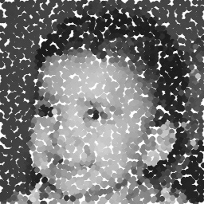
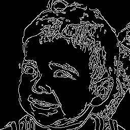
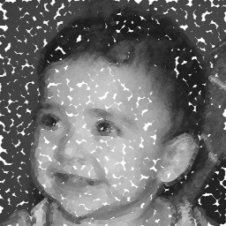
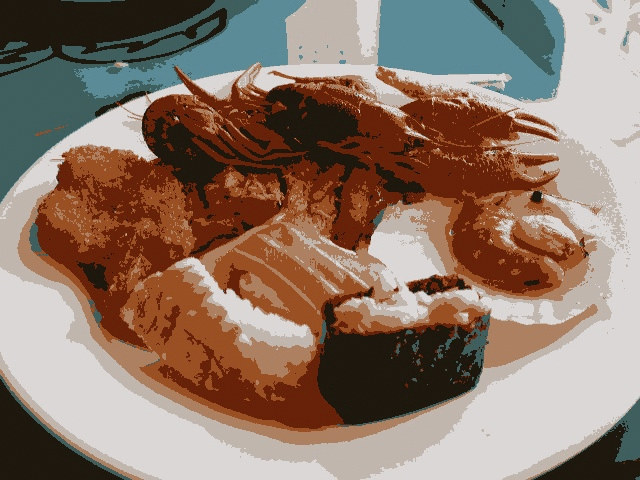

Exercícios **7 - 9** encontrados na [página do professor Agostinho Brito](https://agostinhobritojr.github.io/tutorial/pdi/)

## Filtragem no domínio da frequência

## Detecção de bordas com o algoritmo de Canny

No exercício, que pode ser encontrado [nesse link](https://agostinhobritojr.github.io/tutorial/pdi/#_exerc%C3%ADcios_7), foi pedido para que utilize-se o [código de pontilhismo](https://agostinhobritojr.github.io/tutorial/pdi/exemplos/pontilhismo.cpp) juntamente com o do [algoritmo de Canny](https://agostinhobritojr.github.io/tutorial/pdi/exemplos/canny.cpp) para melhorar a qualidade da imagem pontilhista.

Para isso, primeiramente os dois códigos foram traduzidos pra linguagem python e combinados em um único arquivo. Em seguida gerou-se, com a imagem passada como parâmetro na execução, uma versão pontilhada e uma versão de bordas, que podem ser conferidas nas Figuras 1,2 e 3 abaixo.

<center>
<figure float="middle" class="image">
  
  <figcaption>Figura 1 - Imagem de entrada</figcaption> 
</figure>
<figure class="image">
  
  <figcaption>Figura 2 - Imagem de pontilhada</figcaption>  
</figure>
<figure class="image">
  
  <figcaption>Figura 3 - Imagem com bordas detectadas</figcaption>  
</figure>
</center>

De posse das duas imagens, a combinação delas foi feita conforme mostrado no código abaixo. Os píxels da figura foram percorridos e em cada um deles foi avaliado o valor de sua borda. Sendo o píxel em questão pertencente a uma borda, ou seja, não possuindo a cor preta (0) é desenhado um círculo com as cor do pixel da imagem original.

```python
image = cv.imread(cv.samples.findFile(path), cv.IMREAD_GRAYSCALE)
rows, columns = image.shape
#...
for i in range(rows):
    for j in range(columns):
        if(edges[i, j] != 0):
            gray = image[i,j]
            cv.circle(points,
                    (j, i),
                    CANNY_RADIUS,
                    int(gray),
                    -1,
                    cv.LINE_AA)

```

O resultado pode ser conferido na Figura 4 abaixo:

<center>
<figure class="image">
  
  <figcaption>Figura 4 - Imagem final</figcaption>  
</figure>
</center>

O código na íntegra pode ser encontrado [aqui](https://github.com/daniellycosta/Digital-Image-Processing/blob/main/canny_point/setup.py)

## Quantização vetorial com K-means

Nesse exercício, encontrado [aqui](https://agostinhobritojr.github.io/tutorial/pdi/#_exerc%C3%ADcios_8), foi pedido para que a partir do programa fornecido fossem iniciados os centros de forma aleatória, 10 vezes. Além disso, foi pedido pra explicar o motivo das imagens resultantes poderem divergir tanto.

Assim como nos exercícios anteriores, o primeiro passo foi traduzir o código fornecido para python. Já a partir do segundo é que as modificações foram feitas de fato.
As modificações começaram com a troca da flag de definição de centro com o objetivo de inserir a escolha randômica conforme pode ser visto no trecho abaixo.

```pyhton
 ret,label,center=cv.kmeans(samples,n_clusters,None,criteria,n_attempts,cv.KMEANS_RANDOM_CENTERS)
```

Em seguida englobou-se o código com um laço, de modo a possibilitar as 10 execuções. Ficando como no trecho abaixo

```python
for i in range(10):
    samples = img.reshape((-1,3))
    samples = np.float32(samples)

    criteria = (cv.TERM_CRITERIA_EPS + cv.TERM_CRITERIA_MAX_ITER, 10000, 0.0001)

    ret,label,center=cv.kmeans(samples,n_clusters,None,criteria,n_attempts,cv.KMEANS_RANDOM_CENTERS)

    center = np.uint8(center)
    flattened = center[label.flatten()]
    reshaped = flattened.reshape((img.shape))

    cv.imwrite(f'images/{i}.jpg', reshaped)
```

Os resultados utilizando `n-attempts=1` e `n_cluster=8` podem ser conferidos no GIF da Figura 5, montado com as 10 imagens resultantes do algoritmo.

<center>
<figure class="image">
  
  <figcaption>Figura 5 - GIF com o compilado das 10 imagens geradas pelo algoritmo do K-means</figcaption>  
</figure>
</center>

Como podemos ver as imagens apresentam diferenças perceptíveis entre si, e isso ocorre devido à utilização de centros randômicos no algoritmo kmeans. Com uma quantidade maior de tentativas os resultados tenderiam a ser mais próximos mas utilizando apenas uma tentativa a aleatoriedade se torna mais notável e gera diferentes resultados.

O código na íntegra pode ser encontrado [aqui](https://github.com/daniellycosta/Digital-Image-Processing/blob/main/kmeans/setup.py)
